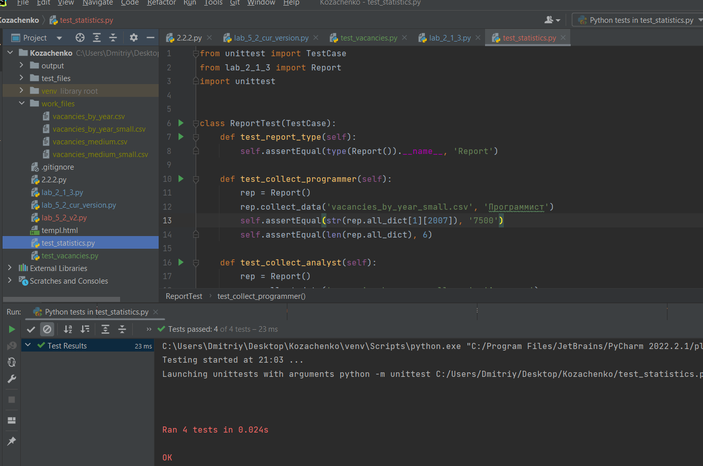
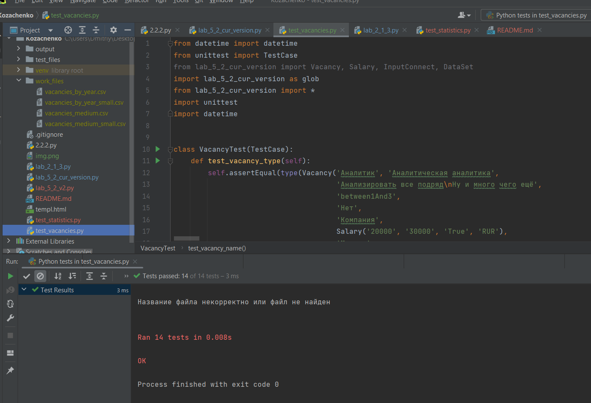
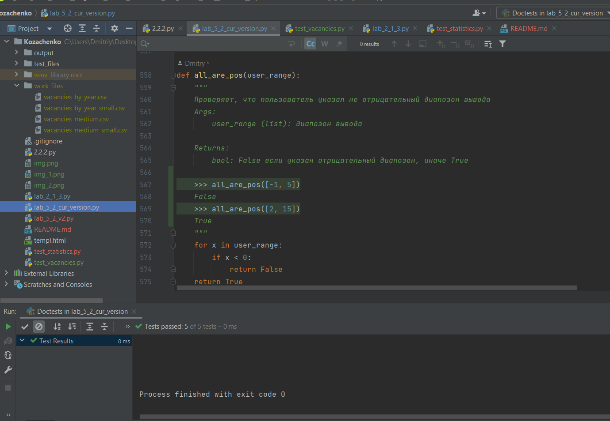
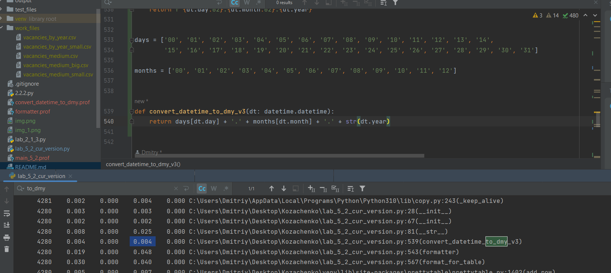
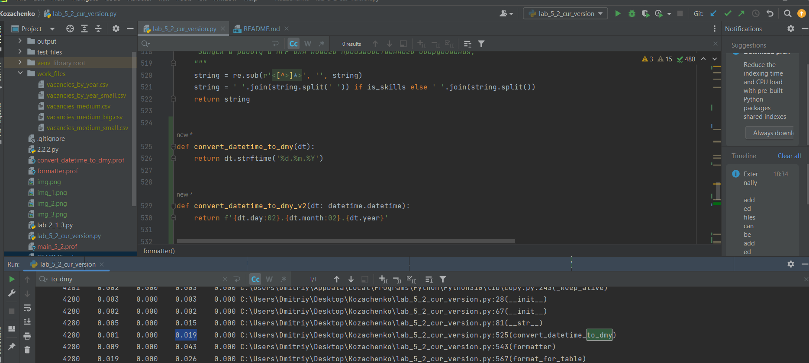
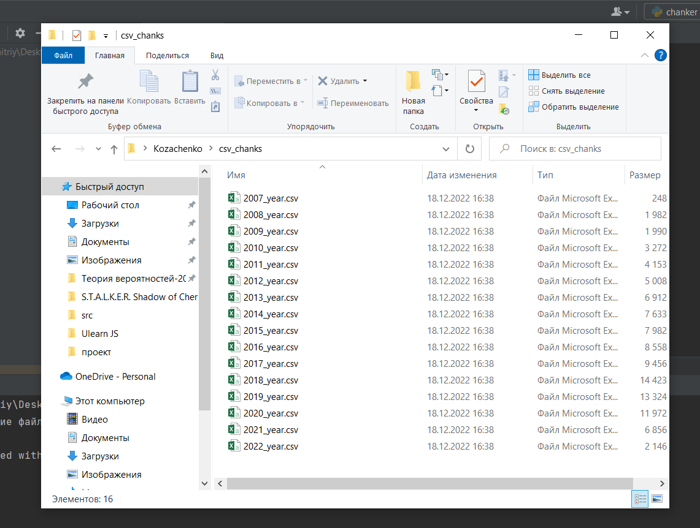
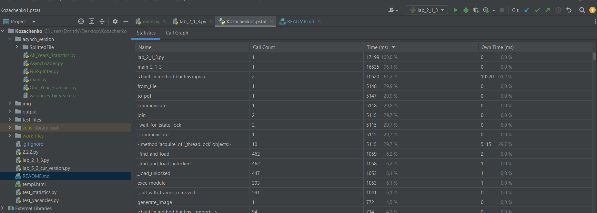
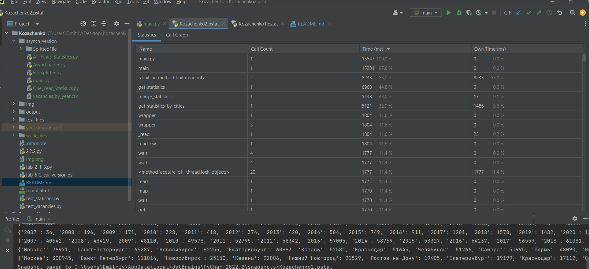
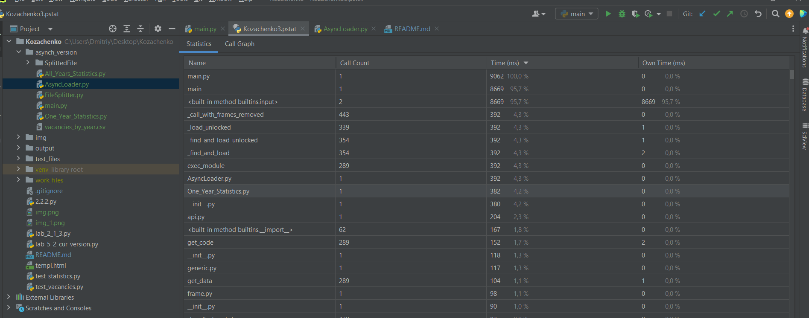
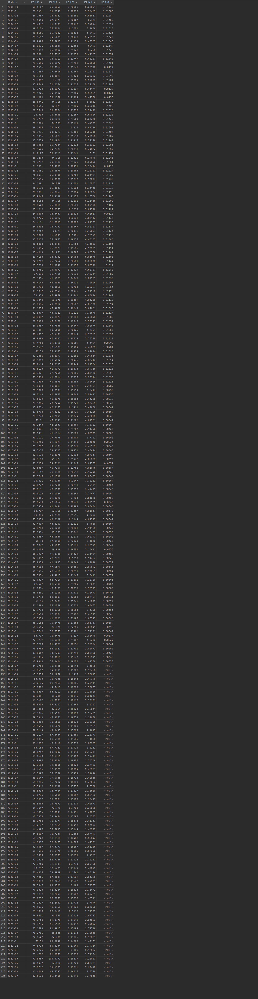

Оценка производительности функции преобразования даты

csv файлы, разделенные по годам

Скорость работы без многопроцессорной обработки

Скорость работы с использованием Multiprocessing

Скорость работы с использованием Concurrent futures

Фото датафрейма частотности с которой встречаются различные валюты, за 2003 – 2022 гг

первые 100 результатов
